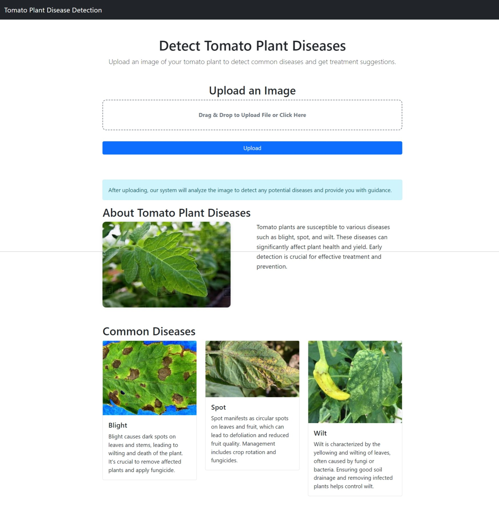

# Tomato Leaf Disease Detection  

A brief description of what this project does and who it's for


## Features

- 10 Tomato Leaf Disease Detection
- Causes, Prevention, Meditions


## Installation

    
## Run Locally

Clone the project

```bash
  git clone https://github.com/anuragsgupta/Tomato-Plant-Disease-Detection.git
```

Go to the project directory

```bash
  cd Tomato-Plant-Disease-Detection
```

Install dependencies

```bash
  pip install -r requirements
```

Start the server

```bash
  python app.py
```


## Screenshots



